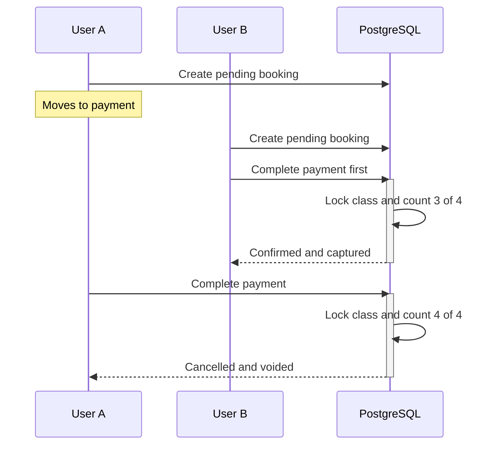

# Ottodot: Trial Class Booking

This project is a small trial-class booking flow built with Next.js and Supabase
Postgres. The main focus is backend correctness, especially duplicate bookings,
payment failure, and two parents competing for the final seat.

Trial classes are limited to four students. A pending booking does not reserve a
seat. The seat is assigned only when payment is completed successfully, and the
database makes that decision inside one transaction.

## Live demo

**https://ottodot-trial-booking.vercel.app**

Deployed on Vercel with a hosted Supabase database in Singapore.

Everyone who opens it shares the same database, so the seeded scenarios may
already have been used by an earlier visitor. In particular, the last-seat race
depends on two specific bookings still being unpaid. Running the project locally
gives a clean database and is the reliable way to reproduce every case.

## How to run the project

### Requirements

- Node.js 20 or later
- Docker Desktop

### Setup

```bash
npm install
npx supabase start
```

The first Supabase startup may take a few minutes because it needs to download
the local Docker images.

Create the local environment file:

```bash
cp .env.example .env.local
```

Copy the local Supabase URL and server-side secret key printed by
`supabase start` into `.env.local`, using the variable names in `.env.example`.

Apply the migrations and seed data, then start the application:

```bash
npm run db:reset
npm run dev
```

Open [http://localhost:3000](http://localhost:3000).

| Command | Purpose |
|---|---|
| `npm run dev` | Start the development server |
| `npm test` | Run the integration tests against local PostgreSQL |
| `npm run db:reset` | Rebuild the local database from migrations and seed data |
| `npm run build` | Create a production build |

## What I built

A parent can:

- Choose one of the seeded parents and children
- View current trial-class availability
- Create a booking
- Simulate a successful or failed payment
- View the final booking status

A teacher or admin can view the confirmed roster as either a page or JSON.

| Route | Purpose |
|---|---|
| `/` | Parent, child, and class selection |
| `/bookings/[bookingId]` | Booking status and simulated payment actions |
| `/roster/[classId]` | Confirmed class roster |
| `/api/trial-classes/[classId]/roster` | The same roster as JSON |

## Verifying the edge cases

The seeded parents and children are named positionally rather than
realistically. The number identifies the parent and the letter identifies the
sibling, so `Child 4B` belongs to `Parent 4`. I changed them from realistic
names partway through because it was slow to remember which child already had a
booking in which class while testing the duplicate and retry cases.

Run this before repeating the seeded scenarios:

```bash
npm run db:reset
```

### Last-seat race

The seeded Junior Science class starts with three confirmed students and two
pending bookings from different families. Open these in separate tabs:

```text
http://localhost:3000/bookings/4
http://localhost:3000/bookings/5
```

Both parents can reach payment because pending bookings do not reserve seats.
Complete booking 5 first, followed by booking 4.

- Booking 5 becomes `confirmed`.
- Booking 4 becomes `cancelled` with `cancellation_reason = 'class_full'`.
- Booking 4 receives a `voided` payment attempt rather than a captured one.
- The roster finishes at exactly four confirmed students.

The order can be reversed. Whichever request obtains the class lock first gets
the final seat.

### Duplicate booking

Select Child 1B and Math Explorers. The child already has an active booking for
that class, so the application redirects to the existing booking instead of
creating another one.

If the existing booking is pending, the parent resumes checkout. If it is
already confirmed, the existing confirmation is shown.

### Payment failure and retry

Select Child 1C and Math Explorers, create a booking, and choose the failed
payment option. The booking becomes `payment_failed` and is not included on the
roster.

The same child can then try again because `payment_failed` bookings are outside
the active-booking unique index.

### Full class

Coding Basics starts at four out of four seats. The UI disables its booking
button, but that is only an early convenience check. The database remains the
final authority because availability shown in the UI can become stale.

## Verification

```bash
npm test
```

The suite contains 20 test cases across four files. Each file covers one area
of the booking flow, including its normal case and relevant error or status
paths.

| File | Test cases |
|---|---:|
| `last-seat-race.test.ts` | 3 |
| `duplicate-booking.test.ts` | 5 |
| `payment-failure.test.ts` | 7 |
| `roster.test.ts` | 5 |

They run against local PostgreSQL rather than a mocked database, because a mock
cannot prove that PostgreSQL row locking works under concurrent requests.

The tests create and remove their own fixtures and never touch the seed data, so
`npm test` can be run safely without rebuilding the demo. `npm run db:reset` is
the destructive command.

The last-seat test creates a fresh class with three confirmed students and runs
two payment confirmations concurrently:

```ts
const [resultA, resultB] = await Promise.all([
  completePayment(fixture.bookingAId),
  completePayment(fixture.bookingBId),
]);
```

It checks that:

- One result is `confirmed` and the other is `class_full`.
- The confirmed count finishes at four.
- The losing booking is cancelled with reason `class_full`.
- The losing payment attempt is `voided`, not `captured`.

The concurrent race is one test case that repeats the scenario 20 times, using
a fresh class each time. The fact that the suite also contains 20 test cases is
coincidental.

Repeating the race does not prove that the locking is correct, but it reduces
the chance of the test passing once because of favourable timing while keeping
the suite quick to run.

### Confirming that the test can fail

As a negative control, I temporarily removed the class-row `FOR UPDATE` and
reran the suite. The concurrent test produced two confirmed results and five
confirmed students against a capacity of four. Restoring the lock returned the
suite to 20 passing tests.

## Backend design

### Architecture and key decisions

I intentionally kept this as a single Next.js application with Supabase
Postgres instead of creating separate frontend and backend services. For a
four-hour exercise, this reduced setup and deployment work while still giving
the solution a relational database with transactions and row locking.

I used Server Actions for internal mutations and one Route Handler for the
roster API. I organized the code by feature and kept the route files thin.
Commands are separate from Server Actions so the integration tests can call the
same booking operations without requiring a Next.js request context.

I did not add repositories or entity classes because the important rules are
already represented by the relational schema and transactional database
functions.

The two payment-outcome transitions live in PostgreSQL functions. A Supabase
client call is a separate HTTP request, so several `.from()` calls cannot be
combined into one application-side transaction. Keeping the booking update,
capacity decision, and payment-attempt insert in one database function makes
the operation atomic.

### Data model

```text
parents -> students -> bookings <- trial_classes
                           |
                           -> payment_attempts
```

| Table | Key fields and relationships |
|---|---|
| `parents` | `id`, `name`, `email` |
| `students` | `id`, `parent_id` → `parents.id`, `name` |
| `trial_classes` | `id`, `name`, `starts_at`, `capacity` |
| `bookings` | `student_id` → `students.id`, `trial_class_id` → `trial_classes.id`, `status`, `cancellation_reason`, `confirmed_at` |
| `payment_attempts` | `booking_id` → `bookings.id`, `status`, `reason` |

The full schema and constraints are in
[`supabase/migrations/`](supabase/migrations/), applied in filename order:
`create_schema`, then `create_views`, then `create_booking_functions`.

Capacity is a column on `trial_classes` rather than a constant in code, so
`confirm_booking()` never refers to the number four. A `CHECK` constraint keeps
it between one and four, which records the brief's limit in the schema while
still allowing smaller classes.

`trial_class_availability` is a read-only view that calculates confirmed and
available seats. There is no separate roster table. The roster is derived from
confirmed bookings so it cannot drift from the booking records.

Statuses use `text` with `CHECK` constraints in PostgreSQL. In TypeScript, the
same values are defined as named constants with derived union types so status
comparisons do not rely on scattered string literals.

### Booking statuses

| Status | Meaning |
|---|---|
| `pending_payment` | Booking created, but no seat reserved |
| `confirmed` | Payment captured and seat assigned |
| `payment_failed` | Payment declined, no seat assigned, retry allowed |
| `cancelled` | Lost the last-seat race with reason `class_full` |

Payment attempts use `captured`, `failed`, or `voided`.

### Main backend entry points

| Entry point | Responsibility |
|---|---|
| `createBookingAction` | Validate input and create or find an active booking |
| `completePaymentAction` | Complete the simulated successful-payment flow |
| `failPaymentAction` | Complete the simulated failed-payment flow |
| `confirm_booking(booking_id)` | Atomically decide capacity, update the booking, and record captured or voided payment |
| `fail_booking_payment(booking_id)` | Atomically mark payment failure and record the failed attempt |
| `GET /api/trial-classes/[classId]/roster` | Return the confirmed class roster as JSON |

Both PostgreSQL functions use `security invoker`, an empty `search_path`, and
fully qualified object names. Execution is restricted to the server-side
service role. The secret key is loaded only from a server-only module.

### Preventing duplicate bookings

An active booking means `pending_payment` or `confirmed`. The database prevents
more than one active booking for the same child and class with a partial unique
index:

```sql
create unique index one_active_booking_per_student_class
  on public.bookings (student_id, trial_class_id)
  where status in ('pending_payment', 'confirmed');
```

The backend checks for an existing booking first so it can return a friendly
result and redirect to it. That check alone is not enough because two requests
can both check before either inserts. If that happens, the unique index allows
one insert and rejects the other with SQLSTATE `23505`. The rejected request
then looks up the booking created by the other request.

The backend check improves the user experience. The unique index provides the
actual guarantee.

### Handling payment failure

`fail_booking_payment()` locks the booking row, verifies that it is still
`pending_payment`, changes it to `payment_failed`, and inserts a failed payment
attempt. Both writes happen in the same transaction.

It does not lock the class because a failed payment cannot consume a seat. The
roster query only returns `confirmed` bookings, so the failed booking is not
included.

### Handling the last-seat race

#### Approach

I chose not to reserve a seat when the parent enters the payment page. Both
parents may reach payment, but the seat is assigned atomically when payment is
confirmed.

`confirm_booking()` first locks the booking and checks that it is still pending.
It then locks the class and recounts the confirmed bookings before deciding the
result. All of this happens in one transaction.



The class row is the serialization point. User B obtains the lock, sees three
confirmed students, and becomes the fourth. If the requests overlap, User A
waits for User B to release the lock. If User B has already committed, User A
can acquire it immediately. In both cases, User A recounts four confirmed
students and is cancelled, so at most one booking can claim the final seat.

#### Why I chose it

The brief explicitly asks what happens when User A reaches payment, User B then
selects the same slot, and User B finishes first. Assigning the seat at payment
confirmation handles that scenario directly. It also keeps the implementation
focused because it does not require reservation expiry or a background job.

Application-level availability checks are not sufficient because both requests
can read the same count before either writes. The decision therefore belongs in
the database, where both requests share the same lock and transaction.

#### Tradeoffs accepted

This flow handles the scenario in the brief, but I would not consider it the
best experience for a real checkout. A parent can spend time completing the
payment step and then find out that another parent took the final seat. The
losing attempt is recorded as `voided`, representing an authorization released
without capture, so the parent is not charged.

For a customer-facing product, I would likely prefer a short seat hold with a
visible countdown. However, that is a different booking flow rather than a
small change. It needs an expiry time, an atomic way to award and release the
hold, cleanup for abandoned holds, and additional UI states. It also moves the
concurrency decision to the point where the hold is created rather than
removing it.

Confirmations for the same class are serialized while the class row is locked.
That is acceptable for classes with four seats, but lock wait time should be
measured if the system grows.

### Responsibility by layer

| Rule | UI | Backend | Database | Background job |
|---|---|---|---|---|
| Valid input | Required fields and disabled submit state | Parse and validate input | Types, `NOT NULL`, and `CHECK` constraints | Not needed |
| Child belongs to parent | Show that parent's children | Verify the submitted relationship | Foreign key keeps the stored relationship valid | Not needed |
| Class availability | Show current availability and disable a full class | Return a friendly early result | Recount under the class lock before confirmation | Not needed |
| Duplicate booking | Prevent accidental resubmission | Find and redirect to an existing booking | Partial unique index | Expire abandoned pending bookings later |
| Payment outcome | Display valid actions and results | Coordinate the request | Guard status transitions and write atomically | Not needed for the simulated flow |
| Confirmed roster | Display confirmed students | Query confirmed bookings | Booking status is the source of truth | Not needed |

The UI provides feedback, and the backend validates and coordinates the flow.
The database owns the rules that must remain correct under concurrency. A
background job is not part of seat allocation. It would be useful later for
expiring abandoned pending bookings.

## Assumptions

- The seeded parent selector stands in for a signed-in parent. It supports the
  booking flow, but it is not an authentication or authorization mechanism.
- Payment is simulated as a result rather than through a fake card form.
- Pending bookings do not reserve seats.
- Trial-class capacity is configured when a class is created and is not edited
  after bookings begin.
- Only confirmed bookings count toward capacity and appear on the roster.
- Losing the final-seat race ends that booking. There is no waitlist.

## What I deliberately cut

I kept the scope focused on the booking rules and the required end-to-end flow.
I deliberately left out:

- **Automatic expiry of abandoned pending bookings.** The current flow returns
  a parent to an existing pending booking. Expiry would need a separate cleanup
  process and another tested status transition.
- **Parent and class management features.** User-initiated cancellation,
  rescheduling, waitlists, notifications, and class editing are separate flows
  from the required booking slice.
- **Regular enrollment and additional UI polish.** Regular enrollment is
  explicitly outside the brief, and I kept the interface focused on making the
  required scenarios easy to verify.

## What I would monitor after release

I would monitor the rules that should never be broken:

- Any class where confirmed bookings exceed capacity
- Duplicate active bookings for the same student and class
- A booking and payment attempt that do not match, such as a captured payment
  for a booking that is not confirmed

I would also monitor:

- How often the booking functions or roster API fail unexpectedly
- How long payment confirmation takes, especially when requests wait for the
  same class lock
- How often parents receive `class_full` after reaching payment
- How many pending bookings remain unfinished for a long time

These numbers would show whether the next priority should be clearer
availability, pending-booking expiry, or a different reservation flow.

## What I would do next with more time

1. Add explicit expiry for abandoned pending bookings and verify that the same
   child can create a new booking after expiry.
2. Improve the demo setup with scenario-specific reset commands so each edge
   case can be repeated without resetting all seed data.
3. Improve loading states, error messages, accessibility, and availability
   refresh behaviour without changing the booking rules.
4. Add one browser-level test for the complete parent booking and roster flow,
   in addition to the existing database integration tests.
5. Add CI to run the database setup, tests, type checking, and production build
   from a clean environment.

## Time spent

Approximately 4 hours and 15 minutes.
